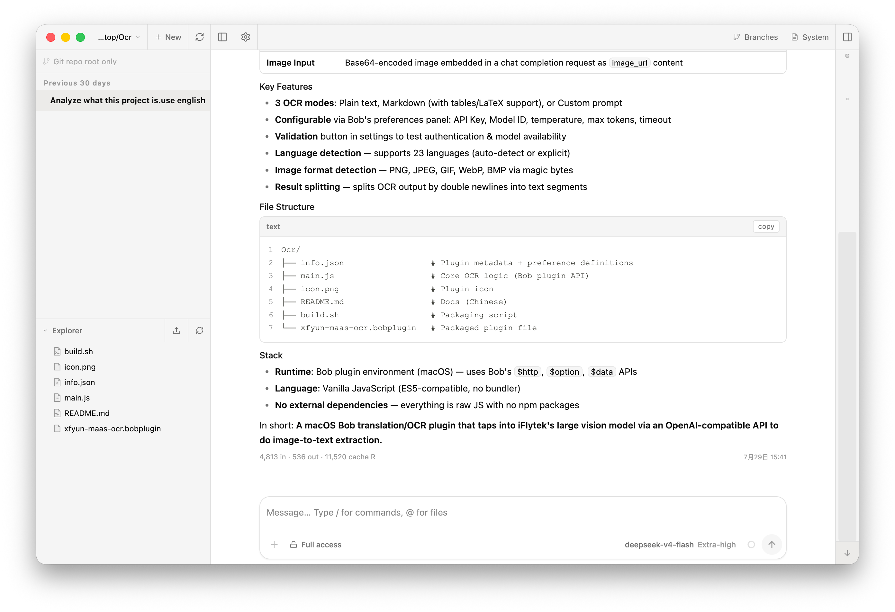
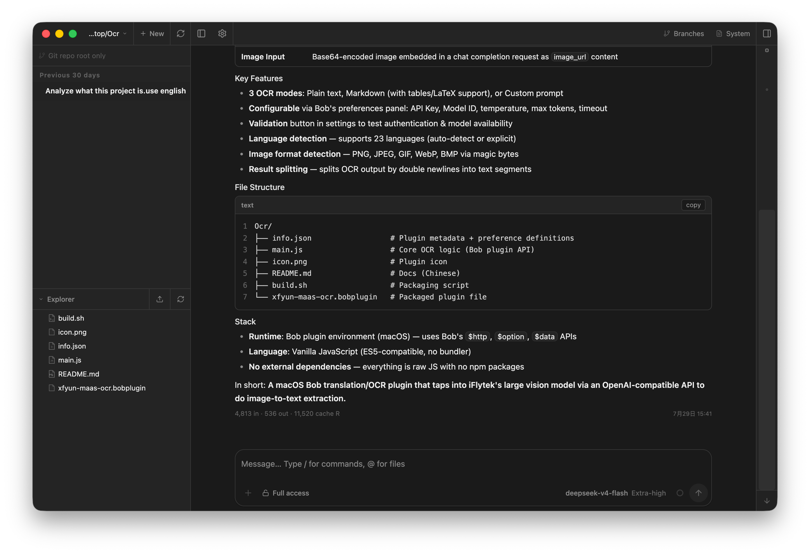

<div align="center">

# RainCode

**本地编程智能体工作区 — 对话、文件、Git、终端一体化**

Electron 桌面端 · 浏览器 UI · [rainflowtb/raincode-desktop](https://github.com/rainflowtb/raincode-desktop)

[](https://nodejs.org/)
[](./LICENSE)
[](#安装)
[](https://github.com/rainflowtb/raincode-desktop)

[English](./README.md)
·
[桌面架构](./docs/desktop-architecture.md)
·
[Releases](https://github.com/rainflowtb/raincode-desktop/releases)
·
[Issues](https://github.com/rainflowtb/raincode-desktop/issues)
·
[LINUX DO](https://linux.do/)

> 基于 [agegr/pi-web](https://github.com/agegr/pi-web) 二次开发：双 runtime 桌面端 + 更完整的本地工作区。

<br/>

<table>
  <tr>
    <td width="50%">
      
      <p align="center"><sub>浅色</sub></p>
    </td>
    <td width="50%">
      
      <p align="center"><sub>深色</sub></p>
    </td>
  </tr>
</table>

</div>

---

RainCode 是跑在你本机上的 **local-first 编程智能体工作区**。  
打开项目、与智能体对话、审查 Git、浏览文件、开终端 —— 可用 **桌面端** 或 **浏览器**。应用本身 **不需要云端账号**；数据在 `~/.raincode`。

| | |
| :--- | :--- |
| 仓库 | [github.com/rainflowtb/raincode-desktop](https://github.com/rainflowtb/raincode-desktop) |
| 桌面端 | macOS arm64/x64 DMG · Windows x64/arm64 NSIS · **`app://` UI + 双 IPC runtime** |
| 浏览器 | Next.js · `http://127.0.0.1:30141` |
| 从源码开发 | Node **≥ 22.19.0** |
| 许可 | MIT |

## 安装

### 桌面端（推荐）

从 [Releases](https://github.com/rainflowtb/raincode-desktop/releases/latest) 下载：

| 平台 | 产物 |
| --- | --- |
| macOS（Apple Silicon） | `RainCode-<version>-arm64.dmg` |
| macOS（Intel） | `RainCode-<version>-x64.dmg` |
| Windows（x64） | `RainCode-<version>-x64.exe` |
| Windows（ARM64） | `RainCode-<version>-arm64.exe` |

安装包 **内置 Node**。终端用户无需安装 Node，也无需再起服务。

> [!NOTE]
> macOS 当前为 **ad-hoc 签名**（未做 Apple 公证）。首次打开可能需要 **右键 → 打开**。

### 浏览器（从源码）

```bash
git clone https://github.com/rainflowtb/raincode-desktop.git
cd raincode-desktop
npm install
npm run dev          # http://127.0.0.1:30141
```

## 能力一览

### 智能体工作区

- **流式对话** — 回复、工具调用 / 结果、thinking 档位、上下文与花费、压缩
- **Agent 模式** — **Ask** · **Auto edit** · **Plan** · **Full access**（编辑门槛与确认合一）
- **权限策略** — 工具 / bash / 路径的 allow · ask · deny；YOLO 只自动通过 *ask*（deny 仍拦截）
- **会话** — 按项目分组、AI 标题、重命名 / 删除、Fork 新会话、会话内分支
- **从此编辑** — 改写 prompt；可选回退该轮之后的文件变更
- **输入区** — `@` 文件提及、斜杠命令、图片附件、运行中 steer / 排队
- **扩展 UI** — 确认 / 选择 / 输入、todos、向用户提问
- **子代理** — Explore / Plan / Reviewer / general-purpose

### 项目工具

- **Git Review 页** — 状态、暂存 / 丢弃、提交、提交并推送、拉取、分支、AI commit message、冲突处理、拆分提交、**Git Review**
- **Worktree** — 列表 / 切换 / 创建 / 删除（[说明](./docs/worktrees.zh-CN.md)）
- **文件** — 资源管理器 CRUD、模糊索引、Monaco 编辑、Markdown / 图片 / 音频 / PDF / DOCX 预览、相对 HEAD diff
- **终端** — 多标签 PTY（xterm + node-pty），跟随项目 cwd
- **Context 面板** — token 与花费、压缩、工作区 undo·redo
- **Debug 页** — Node inspect 轻量调试（可选 / 进阶）

### 模型、技能与桌面体验

- **模型与鉴权** — 供应商、OAuth / 设备码 / API key、自定义端点、模型角色（**default** / **smol** / **plan**）、免费目录、连通测试
- **Skills 与 MCP** — 列表 / 搜索 / 安装技能；MCP（stdio / HTTP）
- **LSP 健康** — 设置页目录与安装提示；智能体 `lsp` 工具
- **项目记忆** — retain / recall / reflect（**默认关闭**，设置中启用）
- **桌面壳** — 托盘（关闭进托盘）、完成通知、提示音、单实例、应用内快捷键、检查更新
- **中英文与主题** — EN / 中文 · 浅色 / 深色 / 跟随系统

```text
┌────────────────┬──────────────────────┬────────────────────────┐
│ 项目与会话     │ 对话 + 工具          │ 右侧工作区             │
│ worktree       │ 模型 · 模式 · 权限   │ Review · 文件 ·        │
│                │ 流式 · 输入区        │ Context · Debug · 终端 │
└────────────────┴──────────────────────┴────────────────────────┘
```

## 架构

### 桌面端（产品主路径）

打包桌面端 **没有** 用于 UI 的回环 Web 服务。Electron 自己提供 SPA，并通过 IPC 连接 **两个** Node 智能体子进程：

```text
Electron main
├── app://pi  →  desktop-dist          (electron/app-protocol.js)
├── BrowserWindow.loadURL("app://pi")
├── ipcMain  pi-api:request / stream   (electron/runtime-host.js)
└── 两个 agent runtime（内置 Node + child IPC）
     ├── light  — 不碰 agent SDK 的路由（会话列表、文件、git、设置壳…）
     └── heavy  — agent SDK、实时对话、ModelRuntime、会话内容…
```

| 层级 | 归属 |
| --- | --- |
| 进程 / 窗口 / 托盘 | `electron/main.js`、`tray.js`、`preload.js` |
| 静态 UI | `electron/app-protocol.js` → `desktop-dist/`（Vite SPA） |
| 双 runtime + IPC | `electron/runtime-host.js` |
| 智能体子进程 | `daemon/ipc-host.mjs` → `dispatch.mjs` → `app/api/**` |
| 渲染层传输 | `lib/api-transport.ts`（桌面 `window.piApi`，浏览器 `fetch`） |

**为何拆两个 runtime？** 加载 agent SDK 会堵死 Node 事件循环数秒。会话列表 / 文件 / git / 设置走 **light**，工作区外壳保持可响应；SDK 在 **heavy** 里预热。Windows 安装包冷启动实测（空 jiti 缓存）：UI ready ~246ms；`/api/sessions` ~396ms；SDK 加载被隔离（约 10s）而不拖死外壳。

完整设计：[docs/desktop-architecture.md](./docs/desktop-architecture.md)。

### 浏览器

```text
浏览器  ──REST + SSE──▶  Next.js（app/ + app/api）· 127.0.0.1:30141
                              │
                              └─ 同一套 app/api + 进程内 AgentSession
```

### 本地数据

| 路径 | 作用 |
| --- | --- |
| `~/.raincode` | 默认数据根（`PI_CODING_AGENT_DIR`） |
| `…/sessions/<cwd>/*.jsonl` | 会话历史 |
| `…/models.json` | 模型 / 供应商 |
| `…/raincode.json` | 设置（角色、代理、Agent 模式、UI、GPU…） |
| `…/auth.json` | 供应商凭据 |
| `…/project-memory/<key>/facts.jsonl` | 项目记忆（启用时） |
| `…/cache/jiti` | 桌面 runtime 转译缓存 |
| Electron 日志 | `app.getPath("logs")/main.log` |

文件访问白名单：会话 cwd、项目根、`~/raincode-*`、以及显式允许的根。

### 安全

- **默认无登录。** 智能体可执行 bash、改文件、调工具。
- 浏览器默认绑定 `127.0.0.1:30141`。桌面 UI **不** 开放公网 HTTP 端口。
- 加载项目本地资源前有 project trust 门禁。
- 权限策略 + Agent 模式；**deny 永远优先于** Full access / YOLO。

## 从源码开发

> 需要 Node.js **≥ 22.19.0**。

```bash
git clone https://github.com/rainflowtb/raincode-desktop.git
cd raincode-desktop
npm install

# 浏览器 UI
npm run dev                 # http://127.0.0.1:30141

# 桌面端（需先构建 SPA）
npm run desktop:build
npm run electron            # app:// + 双 IPC runtime
```

### 打安装包

```bash
npm run build:electron      # 扩展 → SPA → next build（暂存依赖）→ standalone → Node → pi CLI
npm run dist:mac            # DMG + zip（arm64）
npm run dist:dmg            # 仅 DMG
npm run dist:win            # Windows NSIS（x64）
```

`build:electron` 会暂存 `daemon/`、`desktop-dist/`、转译后的 `app/api` 与 `lib`、折叠后的 SDK、内置 Node 与 `pi` shim。默认安装包 **裁掉** Next production server（除非 `PI_WEB_KEEP_NEXT=1`；且 Electron main **不会** 启动 Next）。

| 环境变量 | 作用 |
| --- | --- |
| `PI_CODING_AGENT_DIR` | 智能体数据根（默认 `~/.raincode`） |
| `PI_WEB_RUNTIME_ROLE` | Electron 设置：`light` \| `heavy` |
| `PI_WEB_PREWARM_DELAY_MS` | heavy 扩展预热前的静默窗口（默认 `2000`） |
| `PI_WEB_KEEP_NEXT=1` | 打包时在 standalone 中保留 Next server |
| `PI_WEB_TARGET_PLATFORM` / `PI_WEB_TARGET_ARCH` | 打包时原生模块裁剪 |
| `HTTP_PROXY` / `HTTPS_PROXY` / `NO_PROXY` | 模型 / 工具网络（也可在 设置 → 网络） |

冒烟：

```bash
npm run smoke:ipc
npm run smoke:flows
npm run smoke:electron
```

### 浏览器服务选项

| 脚本 | 绑定 |
| --- | --- |
| `npm run dev` / `start` | `127.0.0.1:30141` |
| `npm run dev:lan` / `start:lan` | `0.0.0.0:30141` — **仅可信网络** |

> [!WARNING]
> **没有登录。** 绑定到非回环地址会暴露高权限智能体接口。

> [!CAUTION]
> **`npm run dev` 运行时不要执行 `npm run build`。** 两者都会写 `.next/`。

## 脚本

| 脚本 | 作用 |
| --- | --- |
| `npm run electron` / `electron:dev` | 启动 Electron（`app://` + 双 IPC） |
| `npm run electron:prod` | 完整 `build:electron` 后启动 |
| `npm run desktop:dev` / `desktop:build` | Vite SPA |
| `npm run daemon` | 单独跑 IPC host（需父进程 IPC） |
| `npm run build:electron` | 桌面打包准备 |
| `npm run dist:mac` / `dist:dmg` / `dist:win` | 安装包 |
| `npm run bundle:sdk` | 折叠 SDK |
| `npm run smoke:ipc` / `smoke:flows` / `smoke:electron` | 桌面冒烟 |
| `npm run dev` / `start` | 浏览器 Next 服务 |
| `npm run lint` | ESLint |

<details>
<summary><b>源码目录</b></summary>

```text
electron/          main、app-protocol（app://）、runtime-host（双 IPC）、tray、preload
daemon/            ipc-host、dispatch、routes、next/server shim
desktop/           Vite SPA 入口 + Next 客户端 shim
desktop-dist/      构建后的 SPA
app/               浏览器 Next UI + 共享 app/api
components/        AppShell、对话、Git、文件、终端、设置…
hooks/             会话 SSE、语言、快捷键、主题、音频
lib/               智能体运行时、api-transport、安全、git、pty、记忆…
scripts/           打包、SDK bundle、IPC smoke
docs/              产品页、desktop-architecture、worktree、截图
```

</details>

## 文档

- [桌面架构](./docs/desktop-architecture.md) — `app://`、light/heavy 拆分、缓存约定
- [Worktree 说明](./docs/worktrees.zh-CN.md)
- [发版清单](./docs/release.md)
- [English README](./README.md)

---

## 社区

本项目在 [LINUX DO](https://linux.do/) 社区开源推广，认可并感谢 LINUX DO — 新的理想型社区，*Where possible begins.*

<a href="https://linux.do?ref=seal-click" target="_blank" rel="noopener noreferrer" title="Best Community · LINUX DO">
  
</a>

---

<div align="center">

**MIT** · [rainflowtb/raincode-desktop](https://github.com/rainflowtb/raincode-desktop) · [LINUX DO](https://linux.do/)

</div>
